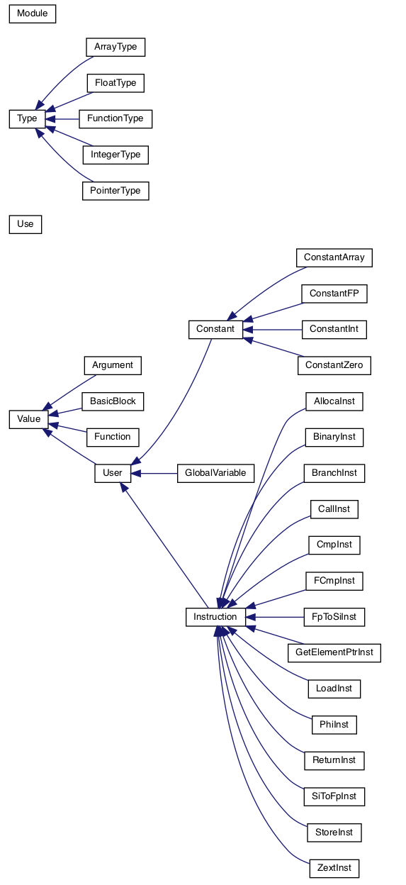

# Light IR
- [Light IR](#light-ir)
  - [Light IR 简介](#lightir-简介)
  - [IR 格式](#ir-格式)
    - [IR 结构图](#ir-结构图)
  - [IR 指令](#ir-指令)
    - [指令格式](#指令格式)
      - [Terminator Instructions](#terminator-instructions)
        - [Ret](#ret)
        - [Br](#br)
      - [Standard binary operators](#standard-binary-operators)
        - [Add FAdd](#add-fadd)
        - [Sub FSub](#sub-fsub)
        - [Mul FMul](#mul-fmul)
        - [SDiv FDiv](#sdiv-fdiv)
      - [Memory operators](#memory-operators)
        - [Alloca](#alloca)
        - [Load](#load)
        - [Store](#store)
      - [CastInst](#castinst)
        - [ZExt](#zext)
        - [FpToSi](#fptosi)
        - [SiToFp](#sitofp)
      - [Other operators](#other-operators)
        - [ICmp FCmp](#icmp-fcmp)
        - [Call](#call)
        - [GetElementPtr](#getelementptr)
  - [C++ APIs](#c-apis)
    - [C++类关系图](#c类关系图)
    - [Module](#module)
    - [BasicBlock](#basicblock)
    - [GlobalVariable](#globalvariable)
    - [Constant](#constant)
    - [Argument](#argument)
    - [Function](#function)
    - [IRBuilder](#irbuilder)
    - [Instruction](#instruction)
    - [Type](#type)
    - [User](#user)
    - [Use](#use)
    - [Value](#value)
    - [注意](#注意)

## LightIR 简介
为了让同学们方便理解并掌握 IR 核心技术，我们从复杂繁琐的 LLVM IR 中裁剪出了本课程实验所需要的精简 IR 子集（我们将其命名为 LightIR），并且实现了轻量级的库来进行 IR 的控制和生成。本文档旨在介绍 LightIR 的结构和具体指令，同时可当作 LightIR [C++ 接口](./LightIR.md#c-apis)的参考手册。LightIR 的 [IR 格式](./LightIR.md#ir-格式)和 [IR 指令](./LightIR.md#ir-指令)部分也可以参考 LLVM 官方的 IR 文档 [LLVM Reference Manual](http://llvm.org/docs/LangRef.html)。

## IR 格式

### IR 结构图
  
我们实验中需要生成的IR代码有着相对固定的结构模式。

- 最上层的是模块，可以理解为一个完整编译单元，来源于一个`cminus-f`源文件。模块包含全局变量和函数定义。
- 函数由头部和函数体组成。函数的头部包括返回值类型、函数名和参数表（每个参数包括类型和值）。函数体可以由多个基本块构成。
- 基本块是指程序顺序执行的语句序列，只有一个入口和一个出口。基本块由若干指令构成。
- 注意一个基本块中的**只能有一条终止指令**（Ret/Br）。

以下面的`easy.c`与`easy.ll`为例进行说明。
通过命令`clang -S -emit-llvm easy.c`可以得到对应的`easy.ll`如下（助教增加了额外的注释）。`.ll`文件中注释以`;`开头。

- `easy.c`:  
  ``` c
  int main(){
    int a;
    int b;
    a = 1;
    b = 2;
    if(a < b)
      b = 3;
    return a + b;
  }
  ```

- `easy.ll`:  
  ``` c
  ; 注释: .ll文件中注释以';'开头
  ; ModuleID = 'easy.c'
  source_filename = "easy.c"
  ; 注释: target的开始
  target datalayout = "e-m:e-p270:32:32-p271:32:32-p272:64:64-i64:64-f80:128-n8:16:32:64-S128"
  target triple = "x86_64-unknown-linux-gnu"
  ; 注释: target的结束
  
  ; 注释: 全局main函数的定义
  ; Function Attrs: noinline nounwind optnone uwtable
  define dso_local i32 @main() #0 {
  ; 注释: 第一个基本块的开始
    %1 = alloca i32, align 4
    %2 = alloca i32, align 4
    %3 = alloca i32, align 4
    store i32 0, i32* %1, align 4
    store i32 1, i32* %2, align 4
    store i32 2, i32* %3, align 4
    %4 = load i32, i32* %2, align 4
    %5 = load i32, i32* %3, align 4
    %6 = icmp slt i32 %4, %5
    br i1 %6, label %7, label %8
  ; 注释: 第一个基本块的结束
  
  ; 注释: 第二个基本块的开始
  7:                                                ; preds = %0
    store i32 3, i32* %3, align 4
    br label %8
  ; 注释: 第二个基本块的结束
  
  ; 注释: 第三个基本块的开始
  8:                                                ; preds = %7, %0
    %9 = load i32, i32* %2, align 4
    %10 = load i32, i32* %3, align 4
    %11 = add nsw i32 %9, %10
    ret i32 %11                                     ; 注释: 返回语句
  ; 注释: 第三个基本块的结束
  }
  
  attributes #0 = { noinline nounwind optnone uwtable "correctly-rounded-divide-sqrt-fp-math"="false" "disable-tail-calls"="false" "frame-pointer"="all" "less-precise-fpmad"="false" "min-legal-vector-width"="0" "no-infs-fp-math"="false" "no-jump-tables"="false" "no-nans-fp-math"="false" "no-signed-zeros-fp-math"="false" "no-trapping-math"="false" "stack-protector-buffer-size"="8" "target-cpu"="x86-64" "target-features"="+cx8,+fxsr,+mmx,+sse,+sse2,+x87" "unsafe-fp-math"="false" "use-soft-float"="false" }
  
  !llvm.module.flags = !{!0}
  !llvm.ident = !{!1}
  
  !0 = !{i32 1, !"wchar_size", i32 4}
  !1 = !{!"clang version 10.0.1 "}
  ```

  其中，每个程序由一个个或多个模块组成，模块之间由链接器合并（本实验中并不涉及）。
  每个模块组成如下：
- 目标信息：
  ``` c
  target datalayout = "e-m:e-p270:32:32-p271:32:32-p272:64:64-i64:64-f80:128-n8:16:32:64-S128"
  target triple = "x86_64-unknown-linux-gnu"
  ```
- 全局符号: 全局变量、函数定义
- 其它信息

每个函数的组成如下：
- 头部：函数返回值类型，函数名，函数参数
- 一个或多个基本块：
  - 每个基本块又有标签和指令组成。
    ``` c
    8:                                                ; preds = %7, %0
      %9 = load i32, i32* %2, align 4
      %10 = load i32, i32* %3, align 4
      %11 = add nsw i32 %9, %10
      ret i32 %11
    ```
    这个例子中，`8`就是标签。
    `%9 = load i32, i32* %2, align 4`中的`%9`是目的操作数，`load`是指令助记符，`i32`是32位整型，`i32*`是指向`i32`的指针类型，`%2`是源操作数，`align 4`表示4字节对齐。

## IR 指令
- 采用 3 地址的方式
  - 区别于 X86 汇编的目标和源寄存器共用的模式： ADD EAX, EBX
  - %2 = add i32 %0, %1
- SSA 形式 + 无限寄存器
  - 每个变量都只被赋值一次
  - 容易确定操作间的依赖关系，便于优化分析
- 强类型系统
  - 每个 Value 都具备自身的类型，
  - IR类型系统：
    - `i1`：1位宽的整数类型
    - `i32`：32位宽的整数类型
    - `float`：单精度浮点数类型
    - `pointer`：指针类型
      - 例如：`i32*, [10 x i32*]`
    - `label`: 基本快的标识符类型
    - `functiontype`： 函数类型，包括函数返回值类型与参数类型

### 指令格式

#### Terminator Instructions
**注**：ret与br都是Terminator Instructions也就是终止指令，在llvm基本块的定义里，基本块是单进单出的，因此只能有一条终止指令（ret或br）。当一个基本块有两条终止指令，clang 在做解析会认为第一个终结指令是此基本块的结束，并会开启一个新的匿名的基本块（并占用了下一个编号）。
##### Ret
- 概念：返回指令。用于将控制流（以及可选的值）从函数返回给调用者。`ret`指令有两种形式：一种返回值，然后终结函数，另一种仅终结函数。
- 格式
  - `ret <type> <value>`
  - `ret void`
- 例子：
  - `ret i32 %0`
  - `ret void`
##### Br
- 概念：跳转指令。用于使控制流转移到当前功能中的另一个基本块。该指令有两种形式，分别对应于条件分支和无条件分支。
- 格式：
  - `br i1 <cond>, label <iftrue>, label <iffalse>`
  - `br label <dest>`
- 例子：
  - `br i1 %cond label %truebb label %falsebb`
  - `br label %bb`
#### Standard binary operators
##### Add FAdd
- 概念：`add`指令返回其两个`i32`类型的操作数之和，返回值为`i32`类型，`fadd`指令返回其两个`float`类型的操作数之和，返回值为`float`类型。
- 格式：
  - `<result> = add <type> <op1>, <op2>`
  - `<result> = fadd <type> <op1>, <op2>`
- 例子：
  - `%2 = add i32 %1, %0`
  - `%2 = fadd float %1, %0`

##### Sub FSub
- 概念：`sub`指令返回其两个`i32`类型的操作数之差，返回值为`i32`类型，`fsub`指令返回其两个`float`类型的操作数之差，返回值为`float`类型。
- 格式与例子与`add`，`fadd`类似

##### Mul FMul
- 概念：`mul`指令返回其两个`i32`类型的操作数之积，返回值为`i32`类型，`fmul`指令返回其两个`float`类型的操作数之积，返回值为`float`类型。
- 格式与例子与`add`，`fadd`类似

##### SDiv FDiv
- 概念：`sdiv`指令返回其两个`i32`类型的操作数之商，返回值为`i32`类型，`fdiv`指令返回其两个`float`类型的操作数之商，返回值为`float`类型。
- 格式与例子与`add`，`fadd`类似

#### Memory operators
##### Alloca
- 概念： `alloca`指令在当前执行函数的堆栈帧上分配内存，当该函数返回其调用者时将自动释放该内存。 始终在地址空间中为数据布局中指示的分配资源分配对象。
- 格式：`<result> = alloca <type>`
- 例子：
  - `%ptr = alloca i32`
  - `%ptr = alloca [10 x i32]`

##### Load
- 概念：`load`指令用于从内存中读取。
- 格式：`<result> = load <type>, <type>* <pointer>`
- 例子：`%val = load i32, i32* %ptr`

##### Store
- 概念：`store`指令用于写入内存。
- 格式：`store <type> <value>, <type>* <pointer>`
- 例子：`store i32 3, i32* %ptr`

#### CastInst
##### ZExt
- 概念：`zext`指令将其操作数**零**扩展为`type2`类型。
- 格式：`<result> = zext <type> <value> to <type2>`
- 例子：`%1 = zext i1 %0 to i32`

##### FpToSi
- 概念：`fptosi`指令将浮点值转换为`type2`（整数）类型。
- 格式：`<result> = fptosi <type> <value> to <type2>`
- 例子：`%Y = fptosi float 1.0E-247 to i32`

##### SiToFp
- 概念：`sitofp`指令将有符号整数转换为`type2`（浮点数）类型。
- 格式：`<result> = sitofp <type> <value> to <type2>`
- 例子：`%X = sitofp i32 257 to float`

#### Other operators
##### ICmp FCmp
- 概念：`icmp`指令根据两个整数的比较返回布尔值，`fcmp`指令根据两个浮点数的比较返回布尔值。
- 格式：
  - `<result> = icmp <cond> <type> <op1>, <op2>`
    - `<cond> = eq | ne | sgt | sge | slt | sle`
  - `<result> = fcmp <cond> <type> <op1>, <op2>`
    - `<cond> = eq | ne | ugt | uge | ult | ule`
- 例子：`i1 %2 = icmp sge i32 %0, %1`

##### Call
- 概念：`call`指令用于使控制流转移到指定的函数，其传入参数绑定到指定的值。 在被调用函数中执行`ret`指令后，控制流程将在函数调用后继续执行该指令，并且该函数的返回值绑定到`result`参数。
- 格式：
  - `<result> = call <return ty> <func name>(<function args>) `
- 例子：
  - `%0 = call i32 @func( i32 %1, i32* %0)`
  - `call @func( i32 %arg)`

##### GetElementPtr
- 概念：`getelementptr`指令用于获取数组结构的元素的地址。 它仅执行地址计算，并且不访问内存。
- 格式：`<result> = getelementptr <type>, <type>* <ptrval> [, <type> <idx>]`
- 参数解释：第一个参数是计算基础类型，第二第三个参数表示索引开始的指针类型及指针，`[]`表示可重复参数，里面表示的数组索引的偏移类型及偏移值。（Question：思考指针类型为`[10 x i32]`指针和`i32`指针`getelementptr`用法的不同，并给出解释，实验结束后回答两者使用情况的区别）
- 例子：
  - `%2 = getelementptr [10 x i32], [10 x i32]* %1, i32 0, i32 %0`
  - `%2 = getelementptr i32, i32* %1 i32 %0`
- **额外阅读（很重要）**：[The Often Misunderstood GEP Instruction](https://llvm.org/docs/GetElementPtr.html)

## C++ APIs

### C++类关系图



上面是c++代码的类关系图。

- `Module`类表示IR的模块，是IR最上层的结构。
- `Type`类表示IR的类型，派生出`ArrayType`, `FloatType`, `FunctionType`, `IntegerType`和`PointerType`等分别表示的数组类型、浮点型、函数类型、整数型和指针类型。例如，函数头部的返回值类型用一个`Type`对象表示，函数的参数表中每个参数的类型也是用`Type`对象表示（通常是`Type`的某个子类），而参数的值则是用`Value`对象表示。返回值类型和参数类型一起构成了函数类型，用`FunctionType`对象表示。
- `Use`类用于描述`Value`的使用情况，`Value`类成员有一个`Use`链表来表示使用其的操作数链表。
- `Value`类表示值，具体可以是`Argument`, `BasicBlock`, `Function`或`User`每一个`Value`对象都会有一个自己的类型。
  - `Function`类表示函数的定义，其中，成员`std::list<Argument *> arguments_`表示函数的参数（形参）。
  - `BasicBlock`表示基本块。
  - `User`类描述了值的使用情况，例如某个`Instruction`使用了哪些操作数。
    - `Constant`类表示常量，派生出各种类型的常量。
    - `GlobalVariable`类表示全局变量，在IR中位于模块内，与函数并列。
    - `Instruction`类表示基本块中的IR指令，派生出具体的各种指令。

下面是对各个类进行具体的介绍。
### Module

- 概念：一个编译单元。在 `cminus-f` 意义下表示一个文件。
<details>
<summary>Module 的定义 （点击此处展开）</summary>

```cpp
class Module
{
public:
    // 将函数f添加到该模块的函数链表上
    // 在函数被创建的时候会自动调用此方法
    void add_function(Function *f);
    // 将全局变量g添加到该模块的全局变量链表上
    // 在全局变量被创建的时候会自动调用此方法
    void add_global_variable(GlobalVariable* g);
    // 获取全局变量列表
    std::list<GlobalVariable *> get_global_variable();
    // 获得（创建）自定义的Pointer类型
    PointerType *get_pointer_type(Type *contained);
    // 获得（创建）自定义的Array类型
    ArrayType *get_array_type(Type *contained, unsigned num_elements);
    // 获得基本类型int32
    IntegerType *get_int32_type();
    // 其他基本类型类似...
private:
    // 存储全局变量的链表
    std::list<GlobalVariable *> global_list_;
    // 存储函数的链表
    std::list<Function *> function_list_;

    // 存储基本类型
    IntegerType *int1_ty_;
    IntegerType *int32_ty_;
    Type *label_ty_;
    Type *void_ty_;
    FloatType *float32_ty_;

    // 存储自定义类型
    std::map<Type *, PointerType *> pointer_map_;
    std::map<std::pair<Type *,int >, ArrayType *> array_map_;
};
```
</details>

### BasicBlock

- 概念：基本块。是一个是单入口单出口的代码块，可以作为分支指令目标对象。

<details>
<summary>BasicBlock 的定义 （点击此处展开）</summary>

```cpp
class BasicBlock : public Value
{
public:
    // 创建并返回基本块，参数分别是基本块所属的模块，基本块名字（默认为空），基本块所属的函数
    static BasicBlock *create(Module *m, const std::string &name, Function *parent);
    // 返回该基本块所属的函数
    Function *get_parent();
    // 返回该基本块所属的模块
    Module *get_module();
    // 返回该基本块的终止指令，若基本块的最后一条指令不是终止指令返回则返回 nullptr
    Instruction *get_terminator();
    // 将指令 instr 添加到该基本块的指令链表末端，使用 IRBuilder 来创建函数时会自动调用此方法
    void add_instruction(Instruction *instr);
    // 将指令 instr 添加到该基本块的指令链表首部
    void add_instr_begin(Instruction *instr);
    // 将指令 instr 从该基本块的指令链表中移除，该 API 会同时维护好 instr 的操作数的 use 链表。
    void delete_instr(Instruction *instr);
    // 判断该基本块是否为空
    bool empty();
    // 返回该基本块中的指令数目
    int get_num_of_instr();
    // 返回该基本块的指令链表
    std::list<Instruction *> &get_instructions();
    // 将该基本块从所属函数的基本块链表中移除
    void erase_from_parent();

    /****************APIs about cfg****************/
    // 返回前驱基本块集合
    std::list<BasicBlock *> &get_pre_basic_blocks();
    // 返回后继基本块集合
    std::list<BasicBlock *> &get_succ_basic_blocks();
    // 添加前驱基本块
    void add_pre_basic_block(BasicBlock *bb);
    // 添加后继基本块
    void add_succ_basic_block(BasicBlock *bb);
    // 移除前驱基本块
    void remove_pre_basic_block(BasicBlock *bb);
    // 移除后继基本块
    void remove_succ_basic_block(BasicBlock *bb);
    /****************APIs about cfg****************/
private:
    // 存储前驱基本块的链表
    std::list<BasicBlock *> pre_bbs_;
    // 存储后继基本块的链表
    std::list<BasicBlock *> succ_bbs_;
    // 存储该基本块指令的链表
    std::list<Instruction *> instr_list_;
    // 指向该基本块所属函数的指针
    Function *parent_;

};
```
</details>

### GlobalVariable
- 概念：全局变量。
<details>
<summary>GlobalVariable 的定义 （点击此处展开）</summary>

```cpp
class GlobalVariable : public User
{
public:
    // 创建一个全局变量
    static GlobalVariable *create(std::string name, Module *m, Type* ty,
                                  bool is_const, Constant* init );
};
```
</details>

### Constant

- 概念：常量。不同类型的常量由不同类来表示。

<details>
<summary>Constant 的定义 （点击此处展开）</summary>

```cpp
class Constant : public User
{
public:
    Constant(Type *ty, const std::string &name = "", unsigned num_ops = 0);
};
```
</details>

<details>
<summary>整型常量 ConstantInt 的定义 （点击此处展开）</summary>

```cpp
class ConstantInt : public Constant
{
private:
    // 该常量表示的值
    int value_;
public:
    // 返回该常量中存的数
    int get_value();
    // 返回常量 const_val 中存的数
    static int get_value(ConstantInt *const_val);
    // 以值 val 来创建常量
    static ConstantInt *get(int val, Module *m);
    // 以值 val 来创建 bool 常量
    static ConstantInt *get(bool val, Module *m);
};
```
</details>

<details>
<summary>浮点数常量 ConstantFP 的定义 （点击此处展开）</summary>

```cpp
class ConstantFP : public Constant
{
private:
    // 该常量表示的值
    float val_;
public:
    // 以值 val 创建并返回浮点数常量
    static ConstantFP *get(float val, Module *m);
    // 返回该常量中存的值
    float get_value();
};

```
</details>

<details>
<summary>ConstantZero 的定义 （点击此处展开）</summary>

```cpp
// 用于全局变量初始化的零常量
class ConstantZero : public Constant 
{
public:
    // 创建并返回零常量
    static ConstantZero *get(Type *ty, Module *m);
};
```
</details>

### Argument

- 概念：函数的参数。

<details>
<summary>Argument 的定义 （点击此处展开）</summary>

```cpp
class Argument : public Value
{
public:
    // 返回该参数的所属的函数
    Function *get_parent();
    // 返回该参数在所在函数的参数列表中的序数
    unsigned get_arg_no() const;
private:
    // 指向该参数的所属的函数的指针
    Function *parent_;
    // 该参数在所在函数的参数列表中的序数
    unsigned arg_no_;
};
```
</details>

### Function
- 概念：函数。该类描述了一个过程，包含多个基本块。

<details>
<summary>Funtion 的定义 （点击此处展开）</summary>

```cpp
class Function : public Value
{
public:
    // 创建并返回函数，参数依次是待创建函数类型 ty，函数名字 name (不可为空)，函数所属的模块 parent
    static Function *create(FunctionType *ty, const std::string &name, Module *parent);
    // 返回该函数的函数类型
    FunctionType *get_function_type() const;
    // 返回该函数的返回值类型
    Type *get_return_type() const;
    // 将基本块 bb 添加至该函数末端（调用基本块的创建函数时会自动调用此函数来）
    void add_basic_block(BasicBlock *bb);
    // 得到该函数参数数量
    unsigned get_num_of_args() const;
    // 得到该函数基本块数量
    unsigned get_num_basic_blocks() const;
    // 得到该函数所属的Module
    Module *get_parent() const;
    // 得到该函数参数列表的起始迭代器
    std::list<Argument *>::iterator arg_begin()
    // 得到该函数参数列表的终止迭代器
    std::list<Argument *>::iterator arg_end()
    // 从函数的基本块链表中删除基本块 bb
    void remove(BasicBlock* bb)
    // 返回函数基本块链表
    std::list<BasicBlock *> &get_basic_blocks()
    // 返回函数的参数链表
    std::list<Argument *> &get_args()
    // 给函数中未命名的基本块和指令命名
    void set_instr_name();
private:
    // 储存基本块的链表
    std::list<BasicBlock *> basic_blocks_;
    // 储存参数的链表
    std::list<Argument *> arguments_;
    // 指向该函数所属的模块的指针
    Module *parent_;
};
```
</details>

### IRBuilder
- 概念：生成IR的辅助类。该类提供了独立的接口创建各种 IR 指令，并将它们插入基本块中（注意：该辅助类不做任何类型检查）。

<details>
<summary>IRBuilder 的定义 （点击此处展开）</summary>

```cpp
class IRBuilder {
private:
    // 该辅助类正在插入的基本块
    BasicBlock *BB_;
    // 该辅助类绑定的模块
    Module *m_;
public:
    // 返回当前插入的基本块
    BasicBlock *get_insert_block()
    // 设置当前插入的基本块
    void set_insert_point(BasicBlock *bb)
    // 创建的指令并对应插入到基本块中，函数名字和参数名字和IR文档是一一对应的
    // 具体查看 IRBuilder.h
    Instruction *create_[instr_type]();
};
```
</details>

### Instruction

- 概念：指令。该类是所有 LLVM 指令的基类。子类包含IR部分中的所有指令。

<details>
<summary>Instruction 的定义 （点击此处展开）</summary>

```c++
class Instruction : public User
{
private:
    // 该指令所属的基本块
    BasicBlock *parent_;
    // 该指令的类型id
    OpID op_id_;
    // 该指令的操作数个数
    unsigned num_ops_;
public:
    // 所有指令的创建都要通过IRBuilder进行，暂不需要关注Instruction类的实现细节
    //（注：不通过IRBuilder来创建指令，而直接调用指令子类的创建方法未经助教完善的测试）
};
```

</details>

### Type

- 概念：IR的类型（包含VoidType、LabelType、FloatType、IntegerType、ArrayType、PointerType）。module中可以通过API获得基本类型，并创建自定义类型。
- 子类介绍：其中ArrayType、PointerType可以嵌套得到自定义类型，而VoidType、 IntegerType，FloatType可看做IR的基本类型，LabelType是BasicBlcok的类型，可作为跳转指令的参数，FunctionType表示函数类型。其中VoidType与LabelType 没有对应的子类，通过Type中的tid_字段判别，而其他类型均有对应子类

<details>
<summary>Type 的定义 （点击此处展开）</summary>

```c++
class Type {
private:
    // 类型种类
    TypeID tid_;
    Module *m_; 
public:
    // 判断是否是ty类型
    bool is_[ty]_type();
    // 获得ty类型
    static Type *get_[ty]_type(Module *m)
    // 若是PointerType则返回指向的类型，若不是则返回nullptr。
    Type *get_pointer_element_type();
    // 若是ArrayType则返回数组元素的类型，若不是则返回nullptr。
    Type *get_array_element_type();
};
```

</details>
<details>
<summary>IntegerType 的定义 （点击此处展开）</summary>

```c++
class IntegerType : public Type {
public:
    explicit IntegerType(unsigned num_bits ,Module *m);
    // 创建 IntegerType 类型，IntegerType 包含 int1 与 int32 
    static IntegerType *get(unsigned num_bits, Module *m );
    // 获得 IntegerType 类型的长度
    unsigned get_num_bits();
private:
    // 表示 IntegerType 类型的长度
    unsigned num_bits_;
};
```

</details>

<details>
<summary>FloatType 的定义 （点击此处展开）</summary>

```c++
class FloatType : public Type {
public:
    FloatType (Module *m);
    // 创建 FloatType 类型
    static FloatType *get(Module *m);
};
```

</details>

<details>
<summary>数组类型 ArrayType 的定义 （点击此处展开）</summary>

```c++
class ArrayType : public Type {
public:
    // 判断数组元素类型是否合法
    static bool is_valid_element_type(Type *ty);
    // 通过数组元素类型contained以及数组长度num_elements创建数组类型
    static ArrayType *get(Type *contained, unsigned num_elements);
    // 得到该数组类型的元素类型
    Type *get_element_type() const;
    // 获得该数组类型的长度
    unsigned get_num_of_elements();
private:
    // 数组元素类型
    Type *contained_;
    // 数组长度
    unsigned num_elements_;
};
```
</details>

<details>
<summary>指针类型 PointerType 的定义 （点击此处展开）</summary>

```c++
class PointerType : public Type {
public:
    // 获取该指针类型指向的元素类型
    Type *get_element_type() const;
    // 创建指向类型为contained的指针类型
    static PointerType *get(Type *contained);
private:
    // 记录指针指向的类型
    Type *contained_;
};
```
</details>

<details>
<summary>函数类型 FunctionType 的定义 （点击此处展开）</summary>

```c++
class FunctionType : public Type {
public:
    // 判断返回值类型是否合法
    static bool is_valid_return_type(Type *ty);
    // 判断参数类型是否合法
    static bool is_valid_argument_type(Type *ty);
    // 根据返回值类型result，参数类型列表params创建函数类型
    static FunctionType *get(Type *result, std::vector<Type*> params);
    // 返回该函数类型的参数个数
    unsigned get_num_of_args() const;
    // 获得该函数类型第i个参数的类型
    Type *get_param_type(unsigned i) const;
    // 获得该函数类型的参数类型链表的起始迭代器
    std::vector<Type *>::iterator param_begin();
    // 获得该函数类型的参数类型链表的结束迭代器
    std::vector<Type *>::iterator param_end();
    // 获得该函数类型的返回值类型
    Type *get_return_type() const;
private:
    // 返回值的类型
    Type *result_;
    // 存储该函数类型的参数类型的链表
    std::vector<Type *> args_;
}
```
</details>

### User
- 概念：使用者。维护了 use-def 信息，表示该使用者用了哪些值。

<details>
<summary>User 的定义 （点击此处展开）</summary>

```cpp
class User : public Value
{
public:
    // 从该使用者的操作数链表中取出第i个操作数
    Value *get_operand(unsigned i) const;
    // 将该使用者的第i个操作数设为值v
    void set_operand(unsigned i, Value *v);
    // 将值v添加到该使用者的操作数链表上
    void add_operand(Value *v);
    // 得到操作数链表的大小
    unsigned get_num_operand() const;
    // 从该使用者的操作数链表中的所有操作数的使用情况中移除该使用者
    void remove_use_of_ops();
    // 移除操作数链表中索引为index1到index2的操作数
    // 例如想删除第0个操作数：remove_operands(0,0)
    void remove_operands(int index1,int index2);
private:
    // 参数列表，表示该使用者用到的参数
    std::vector<Value *> operands_;
    // 该使用者使用的参数个数
    unsigned num_ops_;
};

```
</details>

### Use
- 概念：代表了值的使用情况。

<details>
<summary>Use 的定义 （点击此处展开）</summary>

```cpp
struct Use
{
    // 使用者
    Value *val_;
    // 使用者中值的序数
    // 对于 func(a, b)，a为0，b为1
    unsigned arg_no_;
};
```
</details>

### Value
- 概念：值。代表一个可能用于指令操作数的带类型数据，是最基础的类，维护了 def-use 信息，即该值被哪些使用者使用。

<details>
<summary>Value 的定义 （点击此处展开）</summary>

```cpp
class Value
{
public:
    // 获取该值的类型
    Type *get_type() const;

    // 取得该值的使用情况
    std::list<Use> &get_use_list() { return use_list_; }
    // 添加加该值的使用情况
    void add_use(Value *val, unsigned arg_no = 0);
    // 在所有地方将该值用新的值 new_val 替换，并维护好use_def和def_use链表
    void replace_all_use_with(Value *new_val);
    // 将值 val 从使用链表中移除
    void remove_use(Value *val);
private:
    // 值的类型
    Type *type_;
    // 储存了该值的使用情况的链表
    std::list<Use> use_list_;
};
```
</details>

### 注意

助教在接口文档里筛选了可能会需要用到的接口，如果对API有问题的请移步issue讨论，本次`lightir`接口由助教自行设计实现，并做了大量测试，如有对助教的实现方法有异议或者建议的也请移步issue讨论，**请不要直接修改助教的代码，若因修改助教代码造成后续实验仓库合并的冲突请自行解决**。
