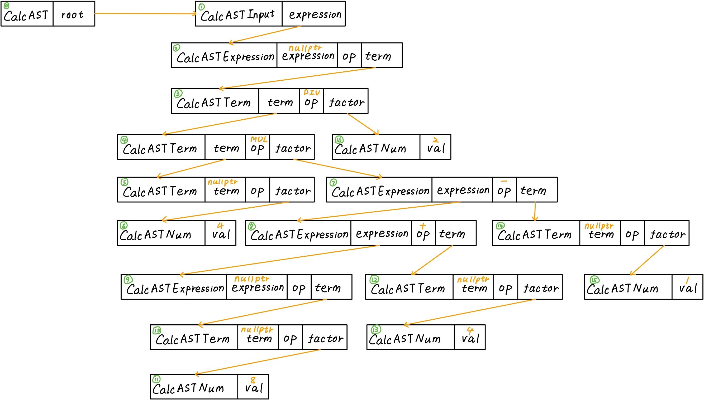

 # lab2 实验报告

## 问题1: getelementptr
请给出 `IR.md` 中提到的两种 getelementptr 用法的区别,并稍加解释:
  - `%2 = getelementptr [10 x i32], [10 x i32]* %1, i32 0, i32 %0`
  - `%2 = getelementptr i32, i32* %1 i32 %0`

​	第一条语句中%1的类型为[10 x i32]，因此需要先索引0，此时类型变为i32 *，这时再索引数组中第一个元素

​	第二条语句中%1的类型为i32*，因此直接索引数组中第一个元素

​	在c语言中，第一条语句相当于

```c
int (*p)[10];
int pr = &p[0][0];
```

​	第二条语句相当于

```c
int *p;
int pr = &p[0];
```

## 问题2: cpp 与 .ll 的对应
请说明你的 cpp 代码片段和 .ll 的每个 BasicBlock 的对应关系。

### assign

cpp代码生成的ll文件如下

```
define i32 @main() {
label_entry:
  %op0 = alloca [10 x i32]
  %op1 = getelementptr [10 x i32], [10 x i32]* %op0, i32 0, i32 0
  %op2 = getelementptr [10 x i32], [10 x i32]* %op0, i32 0, i32 1
  store i32 10, i32* %op1
  %op3 = load i32, i32* %op1
  %op4 = mul i32 %op3, 2
  store i32 %op4, i32* %op2
  %op5 = load i32, i32* %op2
  ret i32 %op5
}
```

文件中只含有一个基本块，对应于下面的cpp代码片段

```cpp
  builder->set_insert_point(bb);
  
  auto aAlloca = builder->create_alloca(arrayType);
  auto a0GEP = builder->create_gep(aAlloca, {CONST_INT(0), CONST_INT(0)});
  auto a1GEP = builder->create_gep(aAlloca, {CONST_INT(0), CONST_INT(1)});
  builder->create_store(CONST_INT(10), a0GEP);
  auto a0Load = builder->create_load(a0GEP);
  auto mul = builder->create_imul(a0Load, CONST_INT(2));
  builder->create_store(mul, a1GEP);
  auto a1Load = builder->create_load(a1GEP);
  builder->create_ret(a1Load);
```

### fun

cpp代码生成的ll文件如下

```
define i32 @callee(i32 %arg0) {
label_entry:
  %op1 = mul i32 %arg0, 2
  ret i32 %op1
}
define i32 @main() {
label_entry:
  %op0 = call i32 @callee(i32 110)
  ret i32 %op0
}
```

#### 基本块1

```
label_entry:
  %op1 = mul i32 %arg0, 2
  ret i32 %op1
```

```cpp
  auto bb = BasicBlock::create(module, "entry", calleeFun);
  builder->set_insert_point(bb);                        // 一个BB的开始,将当前插入指令点的位置设在bb
  std::vector<Value *> args;  // 获取callee函数的形参,通过Function中的iterator
  for (auto arg = calleeFun->arg_begin(); arg != calleeFun->arg_end(); arg++) {
    args.push_back(*arg);   // * 号运算符是从迭代器中取出迭代器当前指向的元素
  }
  auto mul = builder->create_imul(args[0], CONST_INT(2));
  builder->create_ret(mul);
```

#### 基本块2

```
label_entry:
  %op0 = call i32 @callee(i32 110)
  ret i32 %op0
```

```cpp
  bb = BasicBlock::create(module, "entry", mainFun);
  // BasicBlock的名字在生成中无所谓,但是可以方便阅读
  builder->set_insert_point(bb);
  auto call = builder->create_call(calleeFun, {CONST_INT(110)}); // 创建call指令
  builder->create_ret(call);
```

### if

cpp代码生成的ll文件如下

```
define i32 @main() {
label_entry:
  %op0 = alloca float
  store float 0x40163851e0000000, float* %op0
  %op1 = load float, float* %op0
  %op2 = fcmp ugt float %op1,0x3ff0000000000000
  br i1 %op2, label %label_trueBB, label %label_falseBB
label_trueBB:                                                ; preds = %label_entry
  ret i32 233
label_falseBB:                                                ; preds = %label_entry
  ret i32 0
}
```

#### 基本块1

```
label_entry:
  %op0 = alloca float
  store float 0x40163851e0000000, float* %op0
  %op1 = load float, float* %op0
  %op2 = fcmp ugt float %op1,0x3ff0000000000000
  br i1 %op2, label %label_trueBB, label %label_falseBB
```

```cpp
  builder->set_insert_point(bb);
  
  auto aAlloca = builder->create_alloca(FloatType);
  builder->create_store(CONST_FP(5.555), aAlloca);
  auto aLoad = builder->create_load(aAlloca);
  auto fcmp = builder->create_fcmp_gt(aLoad, CONST_FP(1.0));
  auto br = builder->create_cond_br(fcmp, trueBB, falseBB);  // 条件BR
```

#### 基本块2

```
label_trueBB:                                                ; preds = %label_entry
  ret i32 233
```

```cpp
  builder->set_insert_point(trueBB);
  builder->create_ret(CONST_INT(233));
```

#### 基本块3

```
label_falseBB:                                                ; preds = %label_entry
  ret i32 0
```

```cpp
  builder->set_insert_point(falseBB);
  builder->create_ret(CONST_INT(0));
```

### while

cpp代码生成的ll文件如下

```
define i32 @main() {
label_entry:
  %op0 = alloca i32
  %op1 = alloca i32
  store i32 10, i32* %op0
  store i32 0, i32* %op1
  %op2 = load i32, i32* %op1
  %op3 = icmp slt i32 %op2, 10
  br i1 %op3, label %label_trueBB, label %label_falseBB
label_trueBB:                                                ; preds = %label_entry, %label_trueBB
  %op4 = load i32, i32* %op1
  %op5 = add i32 %op4, 1
  store i32 %op5, i32* %op1
  %op6 = load i32, i32* %op0
  %op7 = load i32, i32* %op1
  %op8 = add i32 %op6, %op7
  store i32 %op8, i32* %op0
  %op9 = icmp slt i32 %op7, 10
  br i1 %op9, label %label_trueBB, label %label_falseBB
label_falseBB:                                                ; preds = %label_entry, %label_trueBB
  %op10 = load i32, i32* %op0
  ret i32 %op10
}
```

#### 基本块1

```
label_entry:
  %op0 = alloca i32
  %op1 = alloca i32
  store i32 10, i32* %op0
  store i32 0, i32* %op1
  %op2 = load i32, i32* %op1
  %op3 = icmp slt i32 %op2, 10
  br i1 %op3, label %label_trueBB, label %label_falseBB
```

```cpp
  builder->set_insert_point(bb);
  
  auto aAlloca = builder->create_alloca(Int32Type);
  auto iAlloca = builder->create_alloca(Int32Type);
  builder->create_store(CONST_INT(10), aAlloca);
  builder->create_store(CONST_INT(0), iAlloca);
  auto iLoad = builder->create_load(iAlloca);
  auto icmp = builder->create_icmp_lt(iLoad, CONST_INT(10));
  auto br = builder->create_cond_br(icmp, trueBB, falseBB);  // 条件BR
```

#### 基本块2

```
label_trueBB:                                                ; preds = %label_entry, %label_trueBB
  %op4 = load i32, i32* %op1
  %op5 = add i32 %op4, 1
  store i32 %op5, i32* %op1
  %op6 = load i32, i32* %op0
  %op7 = load i32, i32* %op1
  %op8 = add i32 %op6, %op7
  store i32 %op8, i32* %op0
  %op9 = icmp slt i32 %op7, 10
  br i1 %op9, label %label_trueBB, label %label_falseBB
```

```cpp
  builder->set_insert_point(trueBB);
  iLoad = builder->create_load(iAlloca);
  auto iadd = builder->create_iadd(iLoad,CONST_INT(1));
  builder->create_store(iadd, iAlloca);
  auto aLoad = builder->create_load(aAlloca);
  iLoad = builder->create_load(iAlloca);
  iadd = builder->create_iadd(aLoad,iLoad);
  builder->create_store(iadd, aAlloca);
  icmp = builder->create_icmp_lt(iLoad, CONST_INT(10));
  br = builder->create_cond_br(icmp, trueBB, falseBB);  // 条件BR
```

#### 基本块3

```
label_falseBB:                                                ; preds = %label_entry, %label_trueBB
  %op10 = load i32, i32* %op0
  ret i32 %op10
```

```cpp
  builder->set_insert_point(falseBB);
  aLoad = builder->create_load(aAlloca);
  builder->create_ret(aLoad);
```

## 问题3: Visitor Pattern

分析 `calc` 程序在输入为 `4 * (8 + 4 - 1) / 2` 时的行为：
1. 请画出该表达式对应的抽象语法树（使用 `calc_ast.hpp` 中的 `CalcAST*` 类型和在该类型中存储的值来表示），并给节点使用数字编号。
2. 请指出示例代码在用访问者模式遍历该语法树时的遍历顺序。

序列请按如下格式指明（序号为问题 3.1 中的编号）：  
3->2->5->1



访问语法树的遍历顺序即为序号从小到大的顺序，即0->1->2->3->4->5->6->7->8->9->10->11->12->13->14->15->16，**遍历顺序按照调用各节点的visit函数的顺序记录**

## 实验难点

描述在实验中遇到的问题、分析和解决方案。

### 问题1

**getelementptr inbounds的作用**

​	阅读The Often Misunderstood GEP Instruction后了解到inbounds用于边界检测

### 问题2

**float 5.555在ll文件中报错**

​	阅读LLVM Reference Manual后了解到二进制表示无限的浮点数不能用十进制直接表示，需要转化为IEEE754格式近似表示

### 问题3

**在cpp文件中如何表示浮点常数**

​	查看源代码后，发现可以使用CONST_FP宏，并且在宏中直接使用十进制表示浮点数，宏会将十进制转换为IEEE754格式

### 问题4

**在calc中构建语法树的语法规则**

​	阅读calculator.y文件后了解了语法分析的规则

### 问题5

**builder.build(ast)执行前，ast的结构**

​	通过阅读CalcAST的构造函数CalcAST::CalcAST(syntax_tree* s)和其反复调用的CalcAST::transform_node_iter(syntax_tree_node *n)函数推导出了ast的结构

### 问题6

**factor->num是语法规则，但是CalcASTFactor中不包含CalcASTNum域**

​	通过阅读**calc_ast.hpp**发现struct CalcASTNum: CalcASTFactor，因此可以直接用多态的特性将factor转换为num

## 实验反馈
吐槽?建议

补充介绍calc的代码结构
